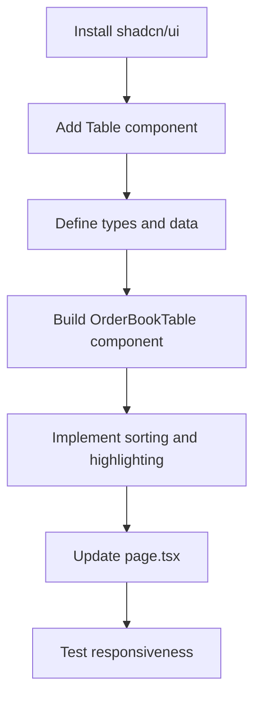

# Mini Order Book UI Implementation Plan

## Overview
Build a responsive order book UI with two tables for bids and asks, using shadcn/ui components and mobile-first design.

## Architecture
- **Framework**: Next.js with TypeScript
- **Styling**: Tailwind CSS
- **UI Library**: shadcn/ui
- **Data**: Hardcoded JSON

## Components
- `OrderBookTable`: Reusable table component for bids/asks
- Main page: Layout with side-by-side tables (stacked on mobile)

## Data Structure
```typescript
interface Order {
  price: number;
  amount: number;
}

interface OrderBookData {
  bids: Order[];
  asks: Order[];
}
```

## Workflow


## Todo List
- [ ] Install and configure shadcn/ui
- [ ] Add Table component from shadcn/ui
- [ ] Define TypeScript interfaces for order book data
- [ ] Create hardcoded JSON data for bids and asks
- [ ] Build OrderBookTable component using shadcn Table with mobile-first design
- [ ] Implement sorting logic (bids desc, asks asc by price)
- [ ] Add highlighting for best bid (highest price) and best ask (lowest price)
- [ ] Update app/page.tsx to display side-by-side tables (stack on mobile)
- [ ] Ensure responsive design with Tailwind CSS (mobile-first)
- [ ] Test the UI for proper display and responsiveness

## Responsive Design
- Mobile: Tables stacked vertically
- Desktop: Tables side by side
- Use Tailwind responsive classes (sm:, md:, etc.)

## Highlighting Logic
- Best bid: Highest price in bids table
- Best ask: Lowest price in asks table
- Use background color or border to highlight

## Sorting
- Bids: Sort descending by price
- Asks: Sort ascending by price